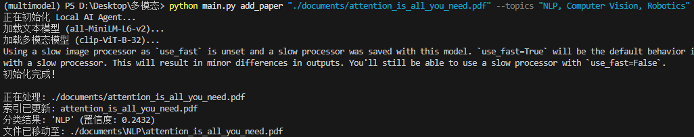
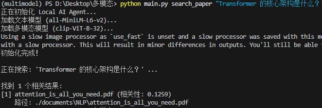
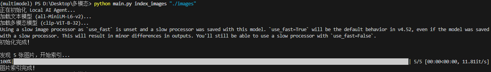
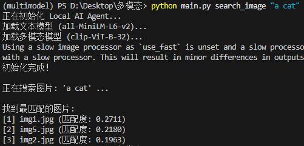
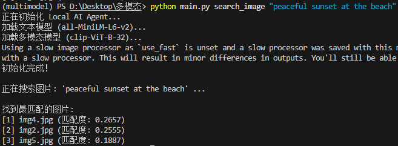

# 本地多模态 AI 智能助手

## 1. 项目简介
本项目是一个基于 Python 的本地 AI 助手，利用 **SentenceTransformers** 和 **CLIP** 模型，实现了对本地 PDF 文献的语义搜索与自动分类，以及对本地图片的“以文搜图”功能。数据存储采用 **ChromaDB**，无需联网即可保护隐私并在本地高效运行。

## 2. 核心功能
* **语义搜索论文**: 理解自然语言提问，而非简单的关键词匹配。
* **智能分类**: 根据论文内容与用户给定的主题（如 CV, NLP）计算相似度，自动归档文件。
* **以文搜图**: 输入自然语言描述（如“海边的日落”），系统返回本地最匹配的图片。

## 3. 环境与依赖
* Python 3.8+
* RAM: 建议 4GB+ (模型运行需要)

### 安装步骤
1. 克隆仓库:
   ```bash
   git clone git@github.com:xxk-2/Local-Multimodal-AI-Agent.git
   cd LocalAIAgent

2. 安装依赖:

    ```bash
    pip install -r requirements.txt
    ```

## 4. 使用说明
项目通过 `main.py` 提供命令行接口。

### 4.1 文献管理
**添加并自动分类论文** 系统会读取 PDF，生成向量，并根据你提供的主题将其移动到对应子文件夹。

```bash
python main.py add_paper "./documents/attention_is_all_you_need.pdf" --topics "NLP, Computer Vision, Robotics"
```
结果: 文件将被移动到 `./documents/NLP/attention_is_all_you_need.pdf`。

**语义搜索论文**

```bash
python main.py search_paper "Transformer 的核心架构是什么？"
```
### 4.2 图像管理
**建立图片索引** 扫描文件夹下的所有图片并存入向量数据库。


```bash
python main.py index_images "./images"
```
**以文搜图**


```bash
python main.py search_image "peaceful sunset at the beach"
```
## 5. 技术选型
文本嵌入: `all-MiniLM-L6-v2` (SentenceTransformers) - 速度快，适合语义匹配。

图像嵌入: `clip-ViT-B-32` (OpenAI CLIP) - 经典的图文对齐模型。

向量数据库: `ChromaDB` - 轻量级嵌入式数据库，支持持久化存储。

PDF处理: `pypdf`


## 6. 效果展示
### 6.1 添加论文
- 命令
```bash
python main.py add_paper "./documents/attention_is_all_you_need.pdf" --topics "NLP, Computer Vision, Robotics"
```
- 运行截图


### 6.2 语义搜索论文
- 命令
```bash
python main.py search_paper "Transformer 的核心架构是什么？"
```
- 运行截图


### 6.3 建立图片索引
- 命令
```bash
python main.py index_images "./images"
```
- 运行截图


### 6.4 以文搜图
#### case 1
- 命令
```bash
python main.py search_image "a cat"
```
- 运行截图


#### case 2
- 命令
```bash
python main.py search_image "peaceful sunset at the beach"
```
- 运行截图

